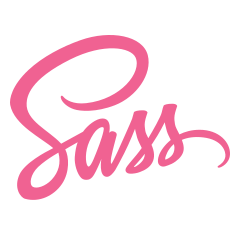

<h1><b>一个热爱前端的程序猿</b></h1> 
<li>热爱前端、热爱技术。喜欢参与一些开源项目的讨论。</li>
<h2>🌔My Skills set</h2>

 - **Frontend**
<a href="https://v3.cn.vuejs.org"><code></code></a>
<a href="https://reactjs.org/"><code></code></a>
<a href="https://nextjs.org/"><code></code></a>
<a href="https://www.tslang.cn/index.html"><code></code></a>
<a href="https://webpack.js.org/"><code></code></a>
<a href="https://cn.vitejs.dev"><code></code></a>
<a href="https://sass-lang.com"><code></code></a>
<a href="https://tailwindcss.com"><code></code></a>
<a href="https://go.dev/"><code></code></a>
<a href="https://www.docker.com"><code></code></a>

