<h1><b>🚀一个热爱前端的程序猿🚄</b></h1> 
<b>热爱前端、热爱技术、热爱游戏、热爱艺术</b>

<!-- <h3>正在开发中🥇</h3>

    
    

  
  

 -->

<h2>🌔</h2>
<a href="https://v3.cn.vuejs.org"><code></code></a>
<a href="https://v3.cn.vuejs.org"><code></code></a>
<a href="https://v3.cn.vuejs.org"><code></code></a>
<a href="https://v3.cn.vuejs.org"><code>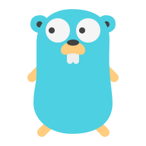</code></a>
<a href="https://v3.cn.vuejs.org"><code></code></a>
<a href="https://v3.cn.vuejs.org"><code>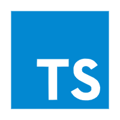</code></a>
<a href="https://v3.cn.vuejs.org"><code>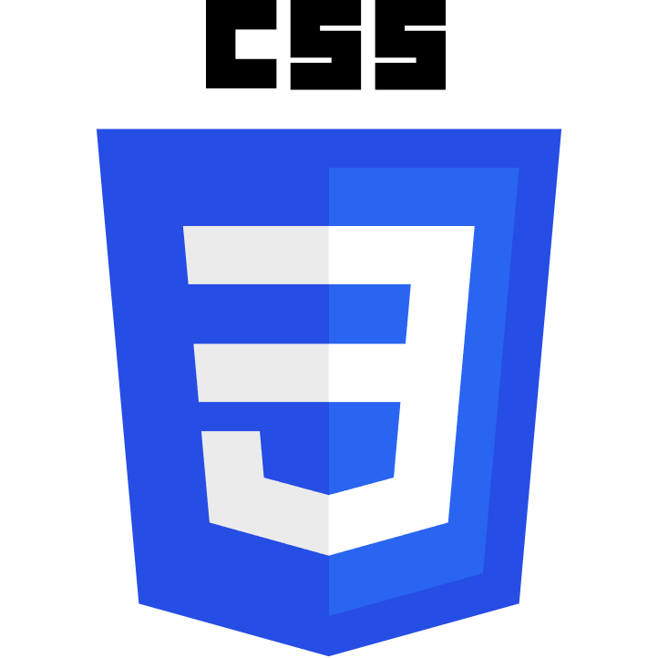</code></a>
<a href="https://v3.cn.vuejs.org"><code></code></a>

<h3>FE Developer(++)</h3>
<a href="https://v3.cn.vuejs.org"><code></code></a>
<a href="https://reactjs.org/"><code></code></a>
<a href="https://cn.vitejs.dev"><code></code></a>
<a href="https://cn.vitejs.dev"><code>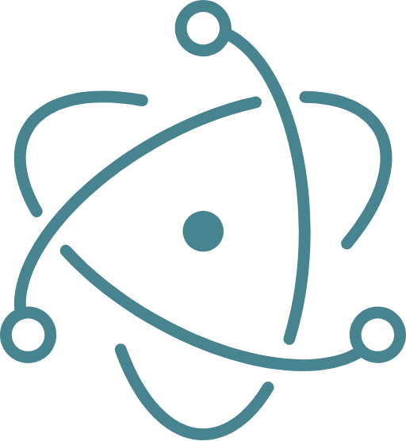</code></a>
<a href="https://cn.vitejs.dev"><code></code></a>
<a href="https://tailwindcss.com"><code>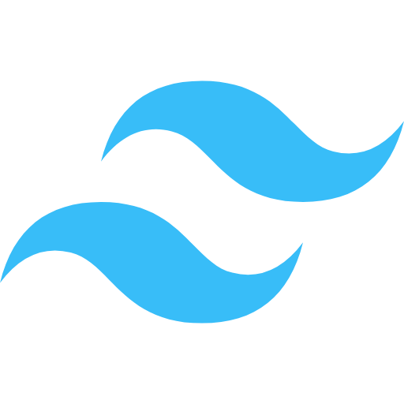</code></a>
<a href="https://tailwindcss.com"><code></code></a>
<a href="https://cn.vitejs.dev"><code></code></a>
<a href="https://cn.vitejs.dev"><code></code></a>
<a href="https://cn.vitejs.dev"><code>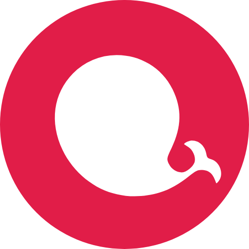</code></a>
<a href="https://cn.vitejs.dev"><code>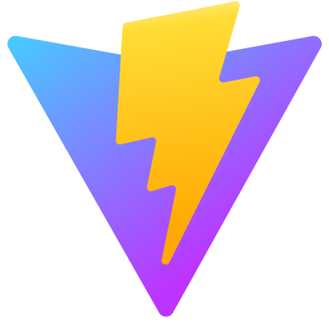</code></a>
<a href="https://cn.vitejs.dev"><code>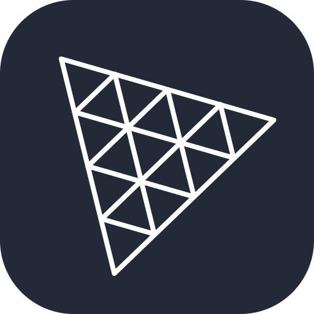</code></a>
<a href="https://cn.vitejs.dev"><code>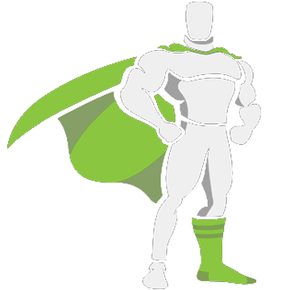</code></a>
<a href="https://cn.vitejs.dev"><code>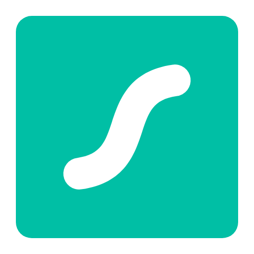</code></a>
<a href="https://cn.vitejs.dev"><code>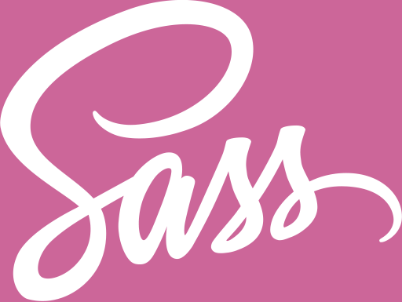</code></a>

<h3>BE Developer(maybe)</h3>
<a href="https://v3.cn.vuejs.org"><code></code></a>
<a href="https://v3.cn.vuejs.org"><code>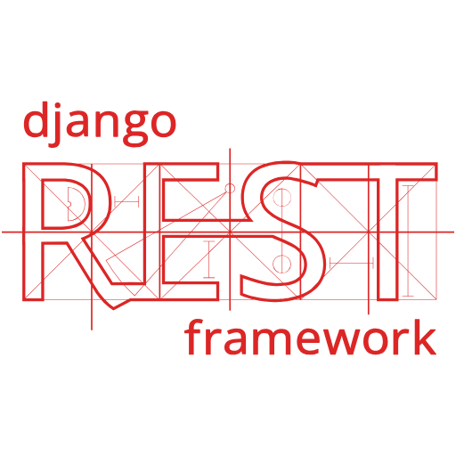</code></a>
<a href="https://v3.cn.vuejs.org"><code>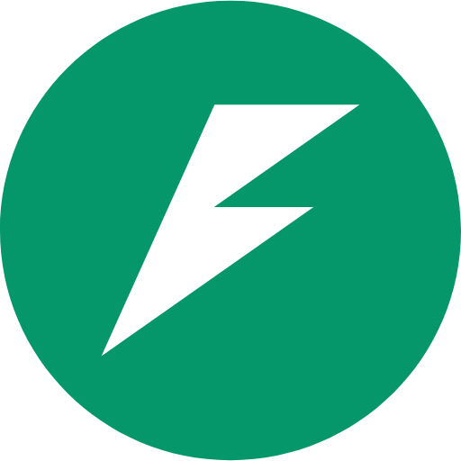</code></a>
<a href="https://v3.cn.vuejs.org"><code>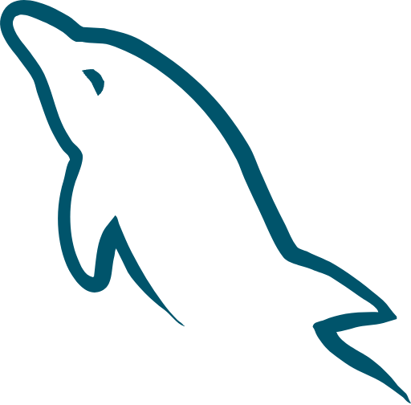</code></a>
<a href="https://v3.cn.vuejs.org"><code></code></a>
<a href="https://v3.cn.vuejs.org"><code>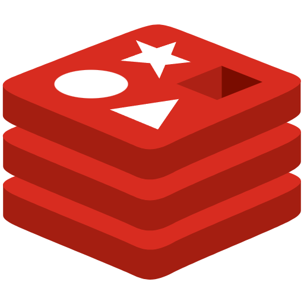</code></a>

<h3>Data Analysis(maybe)</h3>
<a href="https://v3.cn.vuejs.org"><code></code></a>
<a href="https://v3.cn.vuejs.org"><code>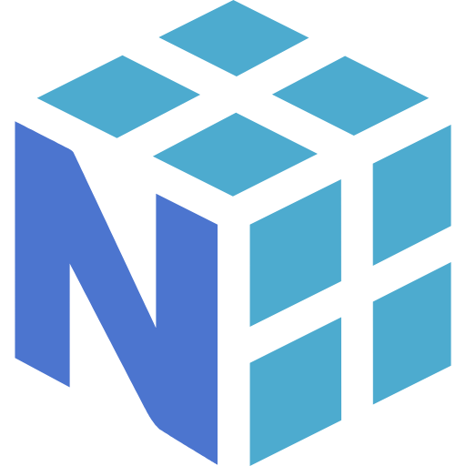</code></a>
<a href="https://v3.cn.vuejs.org"><code>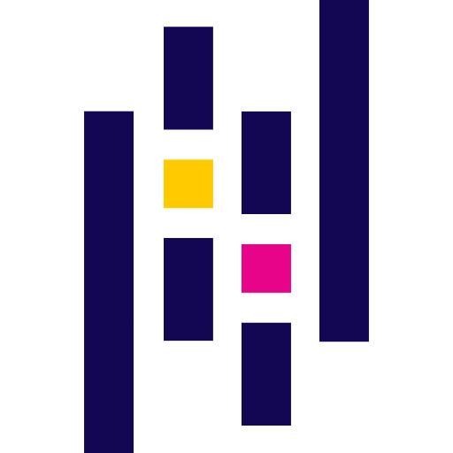</code></a>
<a href="https://v3.cn.vuejs.org"><code></code></a>
<a href="https://v3.cn.vuejs.org"><code>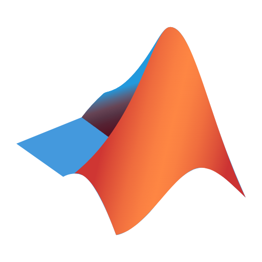</code></a>

<h3>DevOps(-)</h3>
<a href="https://v3.cn.vuejs.org"><code>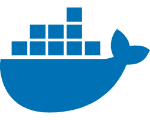</code></a>
<a href="https://v3.cn.vuejs.org"><code>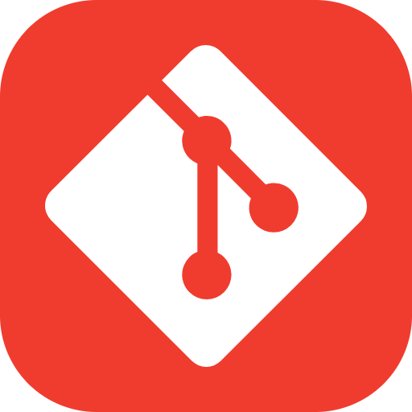</code></a>
<a href="https://v3.cn.vuejs.org"><code>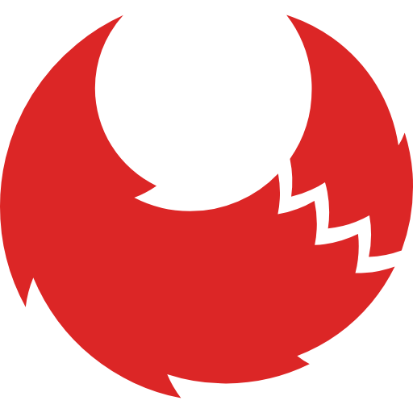</code></a>  
<a href="https://v3.cn.vuejs.org"><code>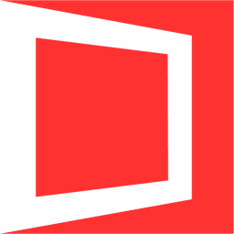</code></a>  
<a href="https://v3.cn.vuejs.org"><code>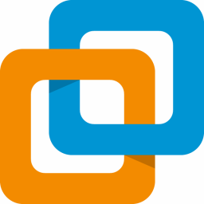</code></a>  
<a href="https://v3.cn.vuejs.org"><code>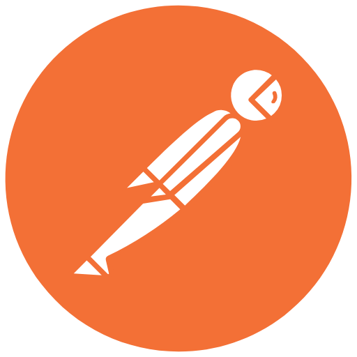</code></a>  

<h3>Tools & Environment</h3>
<a href="https://v3.cn.vuejs.org"><code>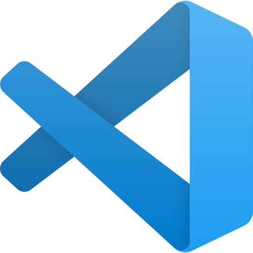</code></a>
<a href="https://v3.cn.vuejs.org"><code>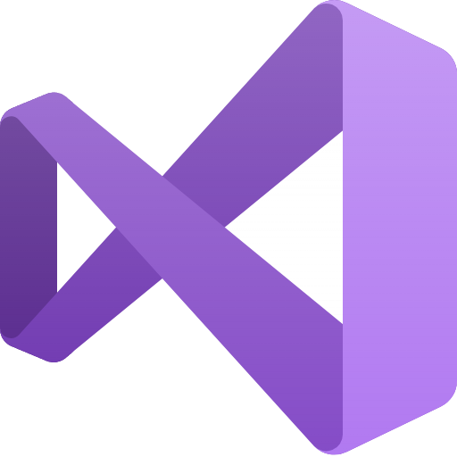</code></a>
<a href="https://v3.cn.vuejs.org"><code>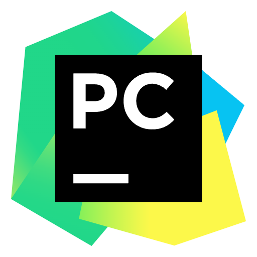</code></a>
<a href="https://v3.cn.vuejs.org"><code>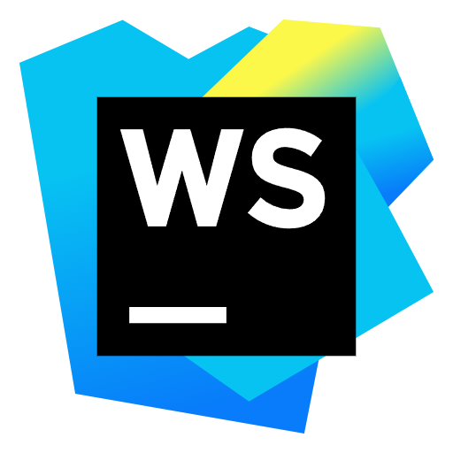</code></a>
<a href="https://v3.cn.vuejs.org"><code>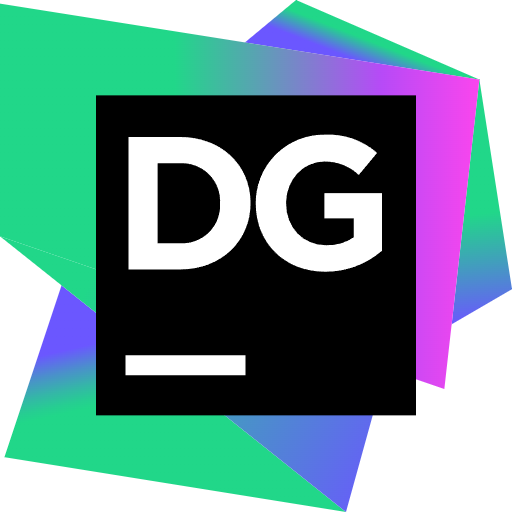</code></a>
<a href="https://v3.cn.vuejs.org"><code>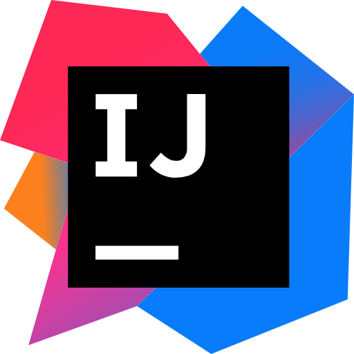</code></a>
<a href="https://v3.cn.vuejs.org"><code></code></a>
<a href="https://v3.cn.vuejs.org"><code>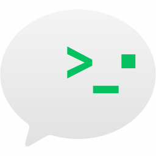</code></a>
<a href="https://v3.cn.vuejs.org"><code></code></a>
<a href="https://v3.cn.vuejs.org"><code>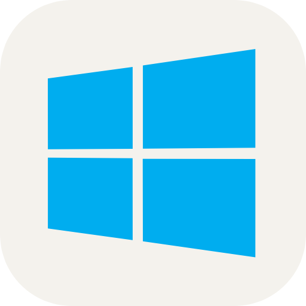</code></a>
<a href="https://v3.cn.vuejs.org"><code></code></a>

<h3>Adobe</h3>
<a href="https://v3.cn.vuejs.org"><code>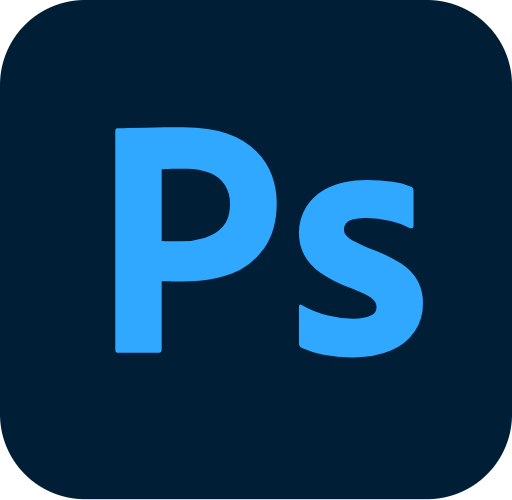</code></a>
<a href="https://v3.cn.vuejs.org"><code></code></a>
<a href="https://v3.cn.vuejs.org"><code>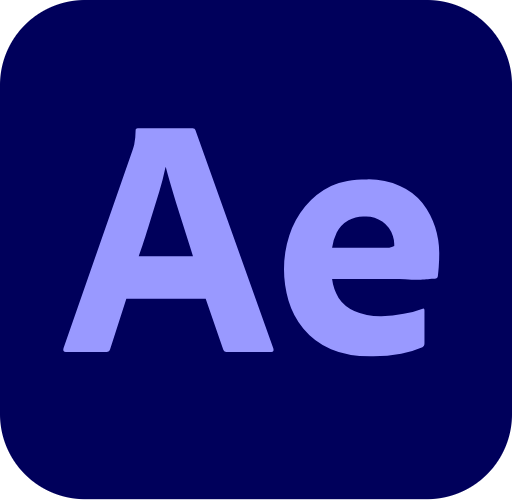</code></a>
<a href="https://v3.cn.vuejs.org"><code></code></a>
<a href="https://v3.cn.vuejs.org"><code></code></a>
<a href="https://v3.cn.vuejs.org"><code></code></a>
<a href="https://v3.cn.vuejs.org"><code></code></a>
<a href="https://v3.cn.vuejs.org"><code></code></a>

<h3>3D Design Tools & Game Development Tools</h3>
<a href="https://v3.cn.vuejs.org"><code>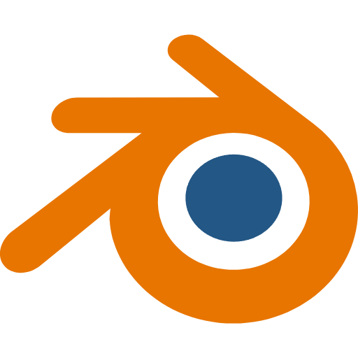</code></a>
<a href="https://v3.cn.vuejs.org"><code></code></a>
<a href="https://v3.cn.vuejs.org"><code>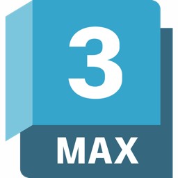</code></a>
<a href="https://v3.cn.vuejs.org"><code></code></a>
<a href="https://v3.cn.vuejs.org"><code></code></a>
<a href="https://v3.cn.vuejs.org"><code></code></a>
<a href="https://v3.cn.vuejs.org"><code></code></a>
<a href="https://v3.cn.vuejs.org"><code>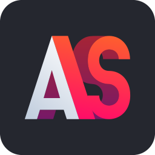</code></a>
<a href="https://v3.cn.vuejs.org"><code></code></a>

<h3>Other Tools</h3>
<a href="https://v3.cn.vuejs.org"><code></code></a>
<a href="https://v3.cn.vuejs.org"><code>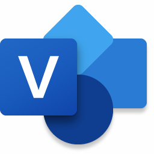</code></a>

<!--
 -->
